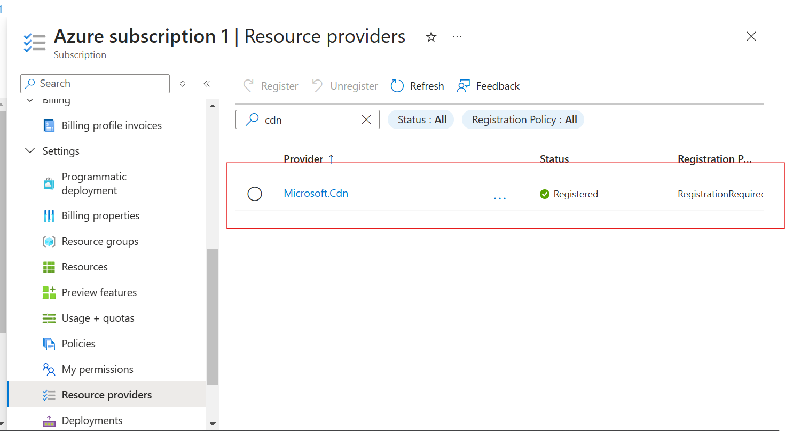
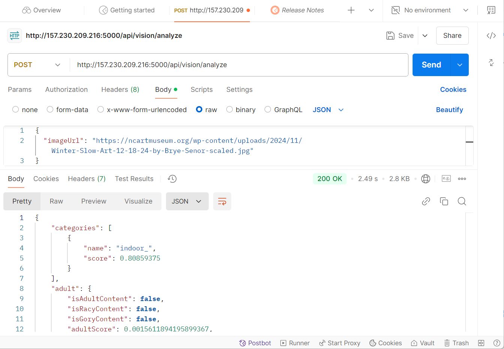
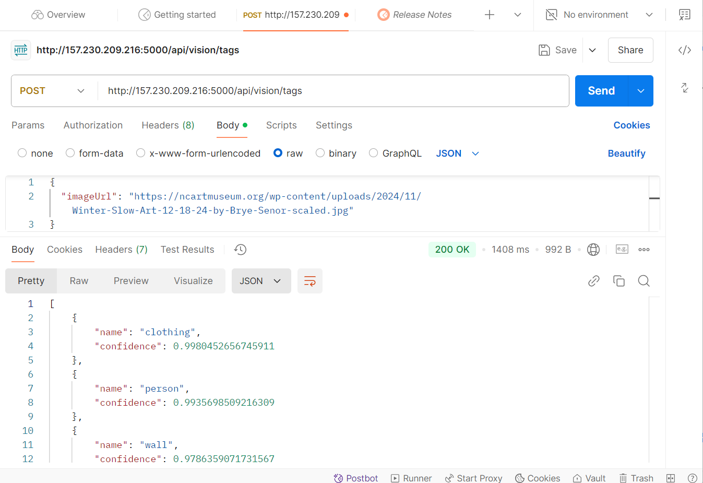
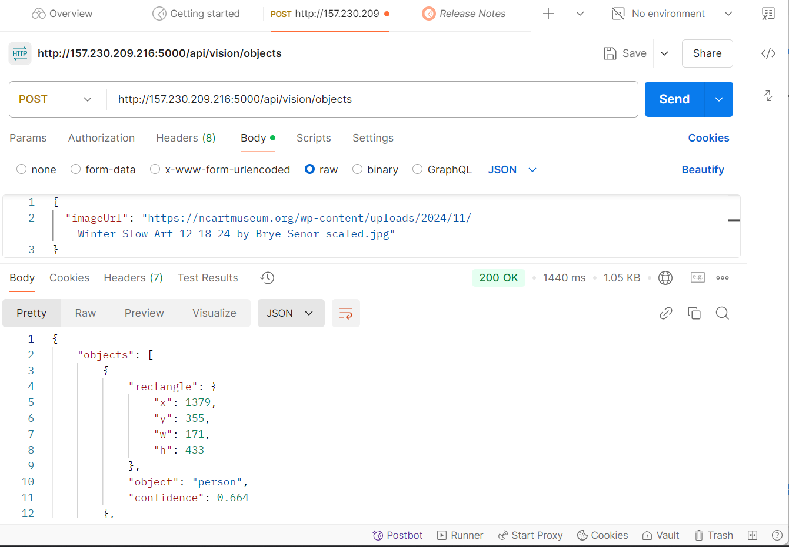
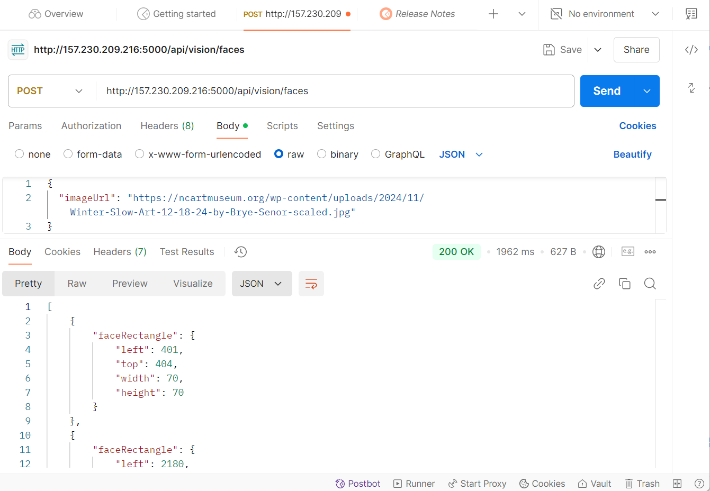
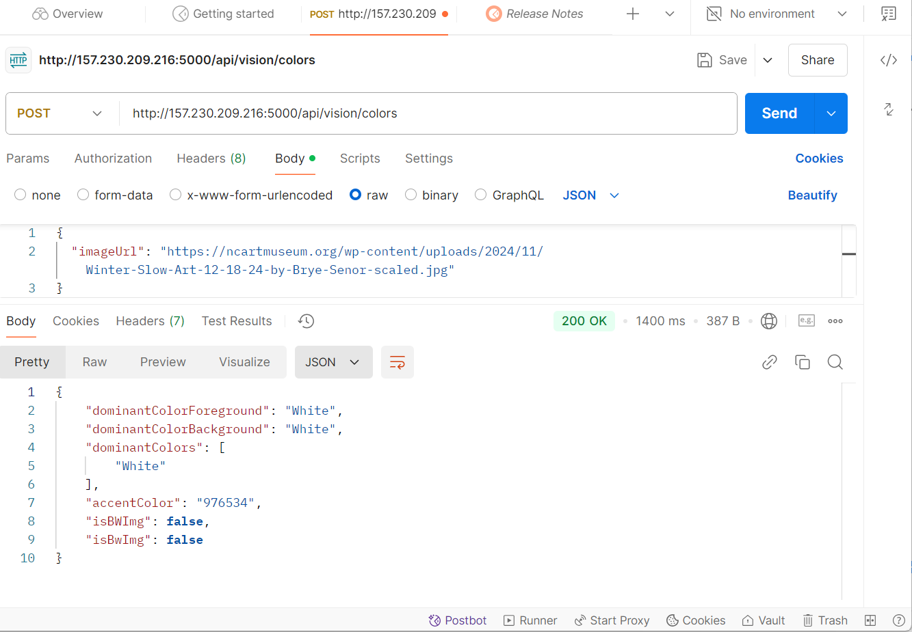

## Azure AI Image Analysis API Documentation

Welcome to the Azure AI Image Analysis API, a powerful tool for analyzing images using Azure’s state-of-the-art Computer Vision capabilities.

## Overview

This API is Developed on the Express.js framework, this API seamlessly incorporates with Azure Cognitive Services, providing robust capabilities for image analysis.

The Azure AI Image Analysis API enables developers to:  

Extract detailed information from images.  
Detect and recognize objects, faces, tags, and colors.  
Recognize printed text and landmarks.  
Generate image descriptions.  

Access the Swagger UI for interactive API documentation:  
`http://157.230.209.216:5000/api-docs/`  

Browse, test endpoints, and experiment with requests directly from your browser.

## Setup and Requirements
## Prerequisites

1.Install Node.js (v14 or higher)  
2.Ensure you have npm installed in your system and run the following command  

# npm install express @azure/cognitiveservices-computervision @azure/ms-rest-azure-js dotenv swagger-jsdoc swagger-ui-express   

3.Azure Cognitive Services account with the Computer Vision resource.  
## **  When creating Azure AI services, registering for Microsoft.Cdn is required  
To register Microsoft.Cdn:  

In Azure Portal:  

Go to Subscriptions,  
Select your subscription,  
Click on Resource providers,  
Search for "Microsoft.Cdn",  
Click "Register"   

## Environment Variables
4.Create a .env file in your project root with the following keys:  

AZURE_API_KEY=your_azure_api_key  
AZURE_ENDPOINT=https://your_resource_name.cognitiveservices.azure.com/  
API_BASE_URL=http://localhost:5000  
PORT=5000    
5. Set up the API code in the app.js file

## Steps to run the project with pm2

## Prerequisites

1.GitHub account with your project repository  
2.DigitalOcean account  
3.Node.js and npm installed on your local machine  

## Deployment Steps
1.Push your project to GitHub  
2.Log in to your DigitalOcean account and create a new Droplet  
3.Connect to your Droplet via SSH and create a project directory  
       mkdir foldername  
4.Clone your repository  
        git clone https://github.com/username/repository.git  
5.Install all the dependencies and set up the application  
6.Start your application using PM2  
        pm2 start app.js  

It will be accessible at     
Server at `http://157.230.209.216:5000/`  
API Documentation at `http://157.230.209.216:5000/api-docs/`  

## Endpoints testing using Postman

Now we will test all the endpoints using postman. Install the Postman application in your system and follow the steps.

## 1. analyze : /api/vision/analyze

The endpoint processes images to extract insights such as object detection, scene categorization, facial recognition, and content moderation. It provides detailed descriptions, tags, and metadata to enhance image analysis and automation.

# Request

URL: `http://157.230.209.216:5000/api/vision/analyze`  
Method: POST  
Request Body:  
{  
  "imageUrl": "https://ncartmuseum.org/wp-content/uploads/2024/11/Winter-Slow-Art-12-18-24-by-Brye-Senor-scaled.jpg"
}  
 # Response  
 Success Response: StatusCode:'200 OK'   
 # Response body  
 {
    "categories": [
        {
            "name": "indoor_",
            "score": 0.80859375
        }
    ],
    "adult": {
        "isAdultContent": false,
        "isRacyContent": false,
        "isGoryContent": false,
        "adultScore": 0.0015611894195899367,
        "racyScore": 0.0025530774146318436,
        "goreScore": 0.0003122377092950046
    },
    "color": {
        "dominantColorForeground": "White",
        "dominantColorBackground": "White",
        "dominantColors": [
            "White"
        ],
        "accentColor": "976534",
        "isBWImg": false,
        "isBwImg": false
    },
    "imageType": {
        "clipArtType": 0,
        "lineDrawingType": 0
    },
    "tags": [
        {
            "name": "clothing",
            "confidence": 0.9980453252792358
        },
        {
            "name": "person",
            "confidence": 0.9935699105262756
        },
        {
            "name": "wall",
            "confidence": 0.9786360263824463
        },
        {
            "name": "footwear",
            "confidence": 0.9714252948760986
        },
        {
            "name": "indoor",
            "confidence": 0.9699792861938477
        },
        {
            "name": "dress",
            "confidence": 0.9574040770530701
        },
        {
            "name": "art",
            "confidence": 0.9289196133613586
        },
        {
            "name": "gallery",
            "confidence": 0.8811023235321045
        },
        {
            "name": "exhibition",
            "confidence": 0.8686392307281494
        },
        {
            "name": "art gallery",
            "confidence": 0.8660522699356079
        },
        {
            "name": "people",
            "confidence": 0.8566343784332275
        },
        {
            "name": "floor",
            "confidence": 0.784436821937561
        },
        {
            "name": "group",
            "confidence": 0.7354892492294312
        },
        {
            "name": "standing",
            "confidence": 0.7085881233215332
        },
        {
            "name": "woman",
            "confidence": 0.6696383357048035
        }
    ],
    "description": {
        "tags": [
            "person",
            "indoor",
            "floor",
            "wall",
            "room"
        ],
        "captions": [
            {
                "text": "a group of people looking at a sculpture in a museum",
                "confidence": 0.5270811915397644
            }
        ]
    },
    "faces": [
        {
            "faceRectangle": {
                "left": 401,
                "top": 404,
                "width": 70,
                "height": 70
            }
        },
        {
            "faceRectangle": {
                "left": 2180,
                "top": 312,
                "width": 58,
                "height": 58
            }
        },
        {
            "faceRectangle": {
                "left": 1234,
                "top": 349,
                "width": 57,
                "height": 57
            }
        },
        {
            "faceRectangle": {
                "left": 1474,
                "top": 385,
                "width": 51,
                "height": 51
            }
        },
        {
            "faceRectangle": {
                "left": 1045,
                "top": 363,
                "width": 49,
                "height": 49
            }
        },
        {
            "faceRectangle": {
                "left": 1628,
                "top": 374,
                "width": 49,
                "height": 49
            }
        }
    ],
    "objects": [
        {
            "rectangle": {
                "x": 1379,
                "y": 355,
                "w": 171,
                "h": 433
            },
            "object": "person",
            "confidence": 0.664
        },
        {
            "rectangle": {
                "x": 965,
                "y": 338,
                "w": 202,
                "h": 618
            },
            "object": "person",
            "confidence": 0.871
        },
        {
            "rectangle": {
                "x": 1165,
                "y": 296,
                "w": 247,
                "h": 612
            },
            "object": "person",
            "confidence": 0.787
        },
        {
            "rectangle": {
                "x": 319,
                "y": 348,
                "w": 284,
                "h": 822
            },
            "object": "person",
            "confidence": 0.774
        },
        {
            "rectangle": {
                "x": 1248,
                "y": 400,
                "w": 619,
                "h": 759
            },
            "object": "person",
            "confidence": 0.528
        },
        {
            "rectangle": {
                "x": 1,
                "y": 342,
                "w": 420,
                "h": 1212
            },
            "object": "person",
            "confidence": 0.801
        },
        {
            "rectangle": {
                "x": 2418,
                "y": 301,
                "w": 141,
                "h": 1253
            },
            "object": "person",
            "confidence": 0.693
        },
        {
            "rectangle": {
                "x": 1880,
                "y": 343,
                "w": 680,
                "h": 1211
            },
            "object": "person",
            "confidence": 0.917
        }
    ],
    "brands": [],
    "requestId": "a3107bb7-dc60-4f91-a5ce-eef3d5dbb2ce",
    "metadata": {
        "width": 2560,
        "height": 1554,
        "format": "Jpeg"
    },
    "modelVersion": "2021-05-01"
}
# 2.tags: /api/vision/tags  

The endpoint analyzes the provided image URL and returns a list of descriptive tags representing objects, people, and settings detected in the image. Each tag includes a confidence score indicating the likelihood of its accuracy. This is useful for categorizing, searching, or organizing image content.  

# Request  

URL: `http://157.230.209.216:5000/api/vision/tags` 
Method: POST  
Request Body:  
{  
  "imageUrl": "https://ncartmuseum.org/wp-content/uploads/2024/11/Winter-Slow-Art-12-18-24-by-Brye-Senor-scaled.jpg"
}  
 # Response  
 Success Response: StatusCode:'200 OK'  

 # Response body
 [
    {
        "name": "clothing",
        "confidence": 0.9980452656745911
    },
    {
        "name": "person",
        "confidence": 0.9935698509216309
    },
    {
        "name": "wall",
        "confidence": 0.9786359071731567
    },
    {
        "name": "footwear",
        "confidence": 0.97142493724823
    },
    {
        "name": "indoor",
        "confidence": 0.9699791669845581
    },
    {
        "name": "dress",
        "confidence": 0.9574040174484253
    },
    {
        "name": "art",
        "confidence": 0.9289198517799377
    },
    {
        "name": "gallery",
        "confidence": 0.8811036348342896
    },
    {
        "name": "exhibition",
        "confidence": 0.8686399459838867
    },
    {
        "name": "art gallery",
        "confidence": 0.8660532236099243
    },
    {
        "name": "people",
        "confidence": 0.8566333055496216
    },
    {
        "name": "floor",
        "confidence": 0.7844362258911133
    },
    {
        "name": "group",
        "confidence": 0.735487699508667
    },
    {
        "name": "standing",
        "confidence": 0.7085868120193481
    },
    {
        "name": "woman",
        "confidence": 0.6696377992630005
    }
]

# 3.objects : /api/vision/objects

The endpoint detects objects in an image, providing their locations and confidence scores. In the example, multiple "person" objects were identified with varying confidence levels, along with image metadata like dimensions and format.

# Request

URL: `http://157.230.209.216:5000/api/vision/objects`  
Method: POST  
Request Body:  
{  
  "imageUrl": "https://ncartmuseum.org/wp-content/uploads/2024/11/Winter-Slow-Art-12-18-24-by-Brye-Senor-scaled.jpg"
}  
 # Response      
 Success Response: StatusCode:'200 OK'     

 # Response body  

 {
    "objects": [
        {
            "rectangle": {
                "x": 1379,
                "y": 355,
                "w": 171,
                "h": 433
            },
            "object": "person",
            "confidence": 0.664
        },
        {
            "rectangle": {
                "x": 965,
                "y": 338,
                "w": 202,
                "h": 618
            },
            "object": "person",
            "confidence": 0.871
        },
        {
            "rectangle": {
                "x": 1165,
                "y": 296,
                "w": 247,
                "h": 612
            },
            "object": "person",
            "confidence": 0.787
        },
        {
            "rectangle": {
                "x": 319,
                "y": 348,
                "w": 284,
                "h": 822
            },
            "object": "person",
            "confidence": 0.774
        },
        {
            "rectangle": {
                "x": 1248,
                "y": 400,
                "w": 619,
                "h": 759
            },
            "object": "person",
            "confidence": 0.528
        },
        {
            "rectangle": {
                "x": 1,
                "y": 342,
                "w": 420,
                "h": 1212
            },
            "object": "person",
            "confidence": 0.801
        },
        {
            "rectangle": {
                "x": 2418,
                "y": 301,
                "w": 141,
                "h": 1253
            },
            "object": "person",
            "confidence": 0.693
        },
        {
            "rectangle": {
                "x": 1880,
                "y": 343,
                "w": 680,
                "h": 1211
            },
            "object": "person",
            "confidence": 0.917
        }
    ],
    "requestId": "7628969c-5aa7-46d3-933d-52e3b3d13d77",
    "metadata": {
        "width": 2560,
        "height": 1554,
        "format": "Jpeg"
    },
    "modelVersion": "2021-04-01"
}

# 4.describe: /api/vision/describe  

The /api/vision/describe endpoint generates a human-readable description of an image, including key tags and captions with confidence scores. In this example, the image was described as "a group of people looking at a sculpture in a museum" with related tags like "person" and "room."

# Request  

URL: `http://157.230.209.216:5000/api/vision/describe`  
Method: POST  
Request Body:  
{  
  "imageUrl": "https://ncartmuseum.org/wp-content/uploads/2024/11/Winter-Slow-Art-12-18-24-by-Brye-Senor-scaled.jpg"
}  
 # Response      
 Success Response: StatusCode:'200 OK'   
 # Response body  

 {
    "tags": [
        "person",
        "indoor",
        "floor",
        "wall",
        "room"
    ],
    "captions": [
        {
            "text": "a group of people looking at a sculpture in a museum",
            "confidence": 0.5270811915397644
        }
    ],
    "requestId": "5b0d9807-c2f8-438d-bd24-9675341348ee",
    "metadata": {
        "width": 2560,
        "height": 1554,
        "format": "Jpeg"
    },
    "modelVersion": "2021-05-01"
}

# 5.text: /api/vision/text  

The /api/vision/text endpoint uses Optical Character Recognition (OCR) to detect and extract printed text from images, including details like language, text angle, and orientation. In cases where no text is detected, the response provides metadata and model version information. It’s ideal for automating workflows that require text extraction from images.

# Request  

URL: `http://157.230.209.216:5000/api/vision/text`  
Method: POST  
Request Body:  
{  
  "imageUrl": "https://ncartmuseum.org/wp-content/uploads/2024/11/Winter-Slow-Art-12-18-24-by-Brye-Senor-scaled.jpg"
}  
 # Response      
 Success Response: StatusCode:'200 OK'   
 # Response body  

 {
    "language": "unk",
    "textAngle": 0,
    "orientation": "NotDetected",
    "regions": [],
    "modelVersion": "2021-04-01"
}

# 6.faces: /api/vision/faces  

The /api/vision/faces endpoint detects faces in an image and returns their locations as bounding rectangles. Each detected face is represented by its position (left, top) and dimensions (width, height). This endpoint is useful for applications involving facial recognition, analysis, or tagging in visual content.

# Request  

URL: `http://157.230.209.216:5000/api/vision/faces`  
Method: POST  
Request Body:  
{  
  "imageUrl": "https://ncartmuseum.org/wp-content/uploads/2024/11/Winter-Slow-Art-12-18-24-by-Brye-Senor-scaled.jpg"
}  
 # Response       
 Success Response: StatusCode:'200 OK'    
 # Response body  

 [
    {
        "faceRectangle": {
            "left": 401,
            "top": 404,
            "width": 70,
            "height": 70
        }
    },
    {
        "faceRectangle": {
            "left": 2180,
            "top": 312,
            "width": 58,
            "height": 58
        }
    },
    {
        "faceRectangle": {
            "left": 1234,
            "top": 349,
            "width": 57,
            "height": 57
        }
    },
    {
        "faceRectangle": {
            "left": 1474,
            "top": 385,
            "width": 51,
            "height": 51
        }
    },
    {
        "faceRectangle": {
            "left": 1045,
            "top": 363,
            "width": 49,
            "height": 49
        }
    },
    {
        "faceRectangle": {
            "left": 1628,
            "top": 374,
            "width": 49,
            "height": 49
        }
    }
]

# 7.colors : /api/vision/colors  

The /api/vision/colors endpoint analyzes the color palette of an image, identifying the dominant foreground and background colors, as well as any accent colors. It also determines whether the image is black and white. This endpoint is ideal for color-based analysis in design, marketing, or image classification applications.

  

# Request  

URL: `http://157.230.209.216:5000/api/vision/colors`  
Method: POST  
Request Body:  
{  
  "imageUrl": "https://ncartmuseum.org/wp-content/uploads/2024/11/Winter-Slow-Art-12-18-24-by-Brye-Senor-scaled.jpg"
}  
 # Response  
 Success Response: StatusCode:'200 OK'   
 # Response body  

 {
    "dominantColorForeground": "White",
    "dominantColorBackground": "White",
    "dominantColors": [
        "White"
    ],
    "accentColor": "976534",
    "isBWImg": false,
    "isBwImg": false
}

# Error handling

This section covers error handling for the checkImageUrl middleware and the processError function used in the API. These methods ensure robust error detection, clear responses, and better debugging during API operations.

# Statuscode 400	Image URL is required  	
The imageUrl field is missing in the request payload.  
# example   
{}  
# Response  
{
    "error": "Image URL is required"
}  

# Statuscode 400	Invalid URL format  
The imageUrl field is provided but does not contain a valid URL string.  
# example  

{ "imageUrl": "invalid-url" }  

# Response  
{
    "error": "Invalid URL format"
}  

# Status code 500	An error occurred during image analysis  	
Any internal server error (e.g., network issues, invalid Azure API credentials, or service downtime).	{ "error": "An error occurred during image analysis" }  

# Example response  
{
    "error": "An error occurred during image analysis"
}  

# Conclusion  

The Azure AI Image Analysis API provides a versatile suite of endpoints to analyze images for various features, including object detection, image descriptions, text recognition, face detection, and color analysis.  
